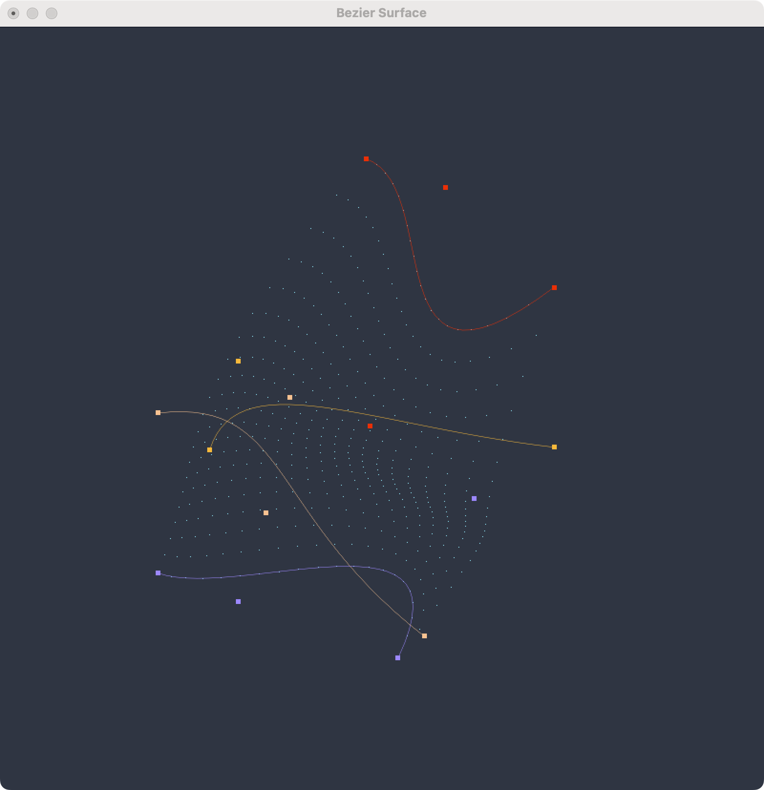
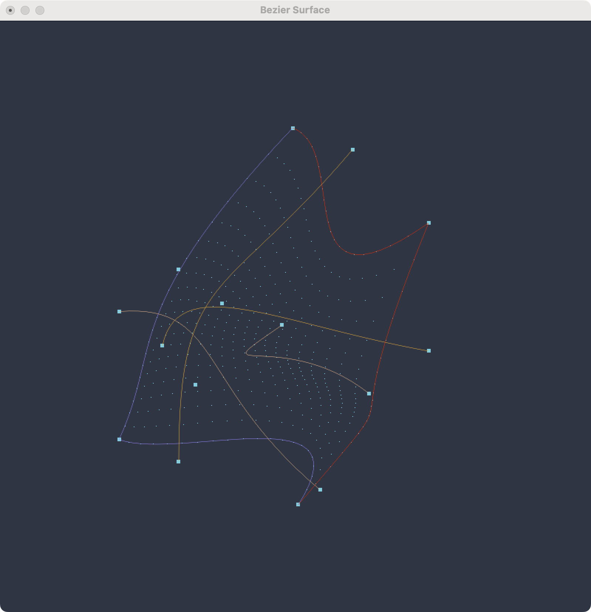

# CG HW3

## 1. Bezier Curve

### 1.1 & 1.2

> 1.1
> 尝试解释以下代码：
> ```python
>   glBegin(GL_LINE_STRIP)
>   for i in range(31):
>       glEvalCoord1f(float(i) / 30)
>   glEnd()
> ```
> 并给出你认为 `glEvalCoord1f` 的合理实现（简要描述）（2分）
> 
> 1.2
> 尝试不使用glEvalCoord1f 画出贝赛尔曲线（4分）

#### 代码解释

**（1.1.1）**

在这段代码前，首先将 `Bezier` 曲线的控制点存入 `controlPoints` 数组中，然后调用 `glMap1f` 函数，将 `controlPoints` 数组中的点映加载到 `GL_MAP1_VERTEX_3` 类型的数据结构上，这样就可以通过 `glEvalCoord1f` 函数对曲线进行求值。

```python
glMap1f(GL_MAP1_VERTEX_3, 0, 1, controlPoints)
glEnable(GL_MAP1_VERTEX_3)
```
在求值绘制的过程中：

```python
    glBegin(GL_LINE_STRIP)
    for i in range(31):
       glEvalCoord1f(float(i) / 30)
    glEnd()
 ```

首先 `glBegin(GL_LINE_STRIP)` 表示开始绘制线段，`glEnd()` 表示结束绘制。

`GL_LINE_STRIP` 表示绘制一系列线段，每个线段的起点是前一个线段的终点。

`glEvalCoord1f` 表示对一维的参数曲线 $L$ 进行求值，即给定一个 $\left[0, 1\right]$ 之间的参数 $u$，求出以对应的点 $L(u)$，在 OpenGL 中，默认进行 `Bezier` 曲线的求值，（即多次线性插值）。

可以参考以下图片理解 `Bezier` 曲线的多次线性插值求值过程：


所以这段代码对曲线参数 $u$ 从 $0$ 到 $1$ 进行了 $31$ 次求值，然后将求值的点连接起来，绘制出了 `Bezier` 曲线。

#### `glEvalCoord1f` 的合理实现

**简述（1.1.2）**

`glEvalCoord1f` 的合理实现，应该是基于 `Bezier` 曲线的定义，即首先在各段曲线（n个点）对参数 $u \in \left[0, 1\right] $ 进行插值，再对插值得到的 n-1 个点进行插值，不断重复以上过程，最后得到一个点，这个点就是 $L(u)$。

**具体实现（1.2）**

一方面，根据 `Bezier` 曲线的定义，可以通过递归线性插值的方法求出 $L(u)$，即：

```python
def evalCoord1f(self, controlPoints, t):
    if len(controlPoints) == 1:
        return controlPoints[0]
    else:
        return (1 - t) * self.evalCoord1f(controlPoints[:-1], t) + t * self.evalCoord1f(controlPoints[1:], t)
```

注意这里可能会多次求解同一个子问题，所以其实也可以通过动态规划的方法自底向上，或将子问题的解存储起来（记忆化）等方式，避免重复计算。

另一方面，也可以通过展开递归，得到 $L(u)$ 的显式表达式，即通过 `Bernstein` 多项式求出 $L(u)$，即：

$$
L(u) = \sum_{i=0}^{n} B_{i}^{n}(u) P_{i}
$$

其中 $B_{i}^{n}(u)$ 表示 `Bernstein` 多项式，$P_{i}$ 表示控制点。

$$
B_{i}^{n}(u) = \binom{n}{i} u^{i} (1-u)^{n-i}
$$

代码如下：

```python
def bernstein(self, n, i, t):
        return comb(n, i) * (t ** i) * ((1 - t) ** (n - i))
    
def evalCoord1f(self, controlPoints, t):
    point = [0, 0, 0]
    int n = len(controlPoints)
    for i in range(n):
        point[0] += self.bernstein(n - 1, i, t) * controlPoints[i][0]
        point[1] += self.bernstein(n - 1, i, t) * controlPoints[i][1]
        point[2] += self.bernstein(n - 1, i, t) * controlPoints[i][2]
    return point
```

这里的 `bernstein` 函数是 `Bernstein` 多项式的实现，`comb` 函数是 `scipy` 库中的组合函数。为了追求速度，可以提前计算好组合数，加速运算。

然后我们仅需要将 `glEvalCoord1f` 函数替换为 `evalCoord1f` 函数，并手动画出这些点，就可以得到一个不使用 `glEvalCoord1f` 画出贝赛尔曲线的实现。

```python
glBegin(GL_LINE_STRIP)
for i in range(31):
    t = float(i) / 30
    x, y, z = self.evalCoord1f(controlPoints, t)
    glVertex3f(x, y, z)
glEnd()
```

理论上用上述的方法都能够根据输入的控制点数量，画出任意阶的 `Bezier` 曲线。

### 1.3

> 尝试利用 4 段 3 次 bezier 曲线画一个圆。（4分）

首先需要明确，`Bezier` 曲线是无法精确表示圆的，我们只能最小化误差，使得 `Bezier` 曲线尽可能接近圆。

首先我们根据前面的公式，展开得出三次 `Bezier` 曲线的显式表达式：

$$
L(u) = (1-u)^{3} P_{0} + 3 u (1-u)^{2} P_{1} + 3 u^{2} (1-u) P_{2} + u^{3} P_{3}
$$

我们将圆分为四段，由对称性，我们只需要考虑其中一段：


由图，我们可以得到 $P_{0} = (0, 0)$，$P_{1} = (x_1, 0)$，$P_{2} = (1, y_1)$，$P_{3} = (1, 1)$。

又由圆的对称性，我们可以得到 $x_1 = 1 - y_1$。

带入，仅取 x 项，可得：

$$
x = (3 x_1 - 2) u^3 + (3 - 6 x_1) u^2 + (3 x_1) u
$$

当 $u=0.5$ 时，由对称性，此时点为弧线中点，若要求与圆重合，应该在四分之一圆弧的二分之一处，即 $x=\sin(\frac{\pi}{4})$

所以我们可以得到：

$$
\sin(\frac{\pi}{4}) = \frac{3 x_1 - 2}{8} + \frac{3 - 6 x_1}{4} + \frac{3 x_1}{2}
$$

可以解得 $x_1 = \frac{4 \left( \sqrt{2} - 1\right)}{3} \approx 0.55228475$

但是此时我们的结果是在限制起点、中点和终点与圆重合的情况下得到的，即整个圆在每 $45^{\circ}$ 处都与 `Bezier` 曲线重合。但实际上，此时的误差在 $+ \frac{1}{2000} \sim + \frac{1}{1000}$ 之间，虽然可以接受，但都为正。

一个真正的“最接近”的圆，应该是误差均匀分布在正负两侧的。其实实际上，通过与半圆的表达式 $ x = \sqrt{1 - (y-1)^2} $ 作差，积分求期望误差最小，我们可以得到，在曲线与圆每 $30^{\circ}$ 处重合时，平均误差最小，此时 $x_1 \approx 0.551784$。

所以按照这个值放置控制点，就可以得到一个用 `Bezier` 曲线近似的圆。


### 抗锯齿

> 关于贝塞尔曲线的抗锯齿，请给出你认为合理的实现（包括但不限于调用 OpenGL 接口/其他手段）（2分）

有多种方式实现 `Bezier` 曲线的抗锯齿：

- 前期曲线生成
    - 通过增加 `Bezier` 曲线的阶数，使得曲线更加光滑，从而减少由于阶数不足导致的锯齿。
    - 多段三阶以上 `Bezier` 曲线的连接处，可以通过使得前后两端的切线相同，即前后控制点位于一条直线上，从而使得曲线更加光滑，从而减少由于连接处不光滑（不可导）导致的锯齿。
- 中期曲线求值
    - 通过增加采样，即增加 `glEvalCoord1f` 的调用时的分段数，使得曲线更加光滑，从而减少由于求值采样不足导致的多段直线连接的锯齿。
- 后期渲染
    - 对于栅格化，可以通过增加像素点的采样，使得曲线更加光滑，从而减少锯齿，比如可以使用 `glEnbale(GL_MULTISAMPLE)` 开启多重采样，以减少由于像素点采样不足导致的锯齿。
    - 渲染时，对于 `GL_LINE_STRIP` 可以通过调用 `glEnable(GL_LINE_SMOOTH)`，使得线段更加光滑，从而减少锯齿。`glHint(GL_LINE_SMOOTH_HINT, GL_NICEST)` 可以设置线段光滑的优先级，GL_NICEST 表示优先级最高，GL_FASTEST 表示优先级最低。
    - 同时，也可以通过 `glEnable(GL_BLEND)` 启用混合，并通过 `glBlendFunc(GL_SRC_ALPHA, GL_ONE_MINUS_SRC_ALPHA)` 设置混合函数，使得线段更加光滑，从而减少锯齿。
    - 经过测试，以上方法具体效果其实依赖于具体硬件接口对实现，不同平台可能表现不同。例如 `glEnbale(GL_MULTISAMPLE)` 对曲线效果就很有限，而启用混合后，曲线效果就会好很多。

以下是开启 AA 前后的对比：


当然，也可以通过其他方式实现 `Bezier` 曲线的抗锯齿，比如通过自定义着色器，对曲线进行抗锯齿，具体而言，可以在片段着色器中，对距离曲线中心一定距离进行指数衰减，从而使得曲线边缘更加光滑，减少锯齿。

例如，下面给出一个可行的实现方案：（时间原因并未实现）

```cpp
uniform float uLineWidth;
uniform vec4 uColor;
uniform float uBlendFactor; // eg. 1.5...2.5, 混合因子
varying vec3 vLineCenter; // 从顶点着色器传入的曲线中心

void main(void){

      vec4 color = uColor;        
      double d = length(vLineCenter - gl_FragCoord.xyz); // 计算片段到曲线中心的距离
      double w = uLineWidth; // 曲线宽度

      if (d>w)
        color.w = 0; // 超出曲线宽度的部分，透明度为0
      else
        color.w *= pow(float((w-d)/w), uBlendFactor); // 距离曲线中心越远，透明度越低

      gl_FragColor = color;
};
```


## 2. Bezier Surface

### 2.1 & 2.2

> 2.1  这段代码已经给出了贝塞尔曲面的光照效果，这部分曲面的生成主要由 `glEvalMesh2(GL_FILL, 0, 20, 0, 20)` 完成，请给出你认为 `glEvalMesh2` 的实现（简要描述）（2分）
> 2.2  请你注释掉材质和光照效果并注释掉 `glEvalMesh2(GL_FILL, 0, 20, 0, 20)` 尝试不使用 `glEvalMesh2` 画出贝塞尔曲面（只画出贝塞尔曲面生成的控制点即可），并对其进行旋转从多方面观察（6分）

#### 实现分析

在执行 `glEvalMesh2(GL_FILL, 0, 20, 0, 20)` 之前，首先需要调用 `glMap2f` 函数，将 `controlPoints` 数组中的点映射到 `GL_MAP2_VERTEX_3` 类型的数据结构上，生成评估器。并调用 `glMapGrid2f` 函数，设置评估后面评估需求的步长，生成评估网格（或者就叫求值网格，直译问题）。

```python
glMap2f(GL_MAP2_VERTEX_3, 0, 1, 0, 1, controlPoints)
glMapGrid2f(20, 0.0, 1.0, 20, 0.0, 1.0)
glEnable(GL_MAP2_VERTEX_3)
```

然后，我们就可以调用 `glEvalMesh2(GL_FILL, 0, 20, 0, 20)` 函数，根据评估网格生成的 $u-v$ 平面上的点，对 `Bezier` 曲面进行求值，然后根据 `GL_FILL` 模式，填充生成的曲面。

具体来说，`glEvalMesh2` 函数会对评估网格中的每一个点，根据 `Bezier` 曲面的定义，通过对各控制点进行多次线性插值（具体来讲可以先对u方向每条 `Bezier` 曲线进行插值，然后对插值结果的控制点组成的 v 方向的 `Bezier` 曲线进行插值，下面会详细给出），得到一个点。与此同时，还会同步对曲面的法向量等进行计算和插值，从而实现光照效果。在得到所有的点后，根据 `GL_FILL` 模式，填充生成的曲面，也可以使用 `GL_LINE` 模式或 `GL_POINT` 模式，分别绘制曲面的网格边界和顶点。

#### 代码实现

下面我们只考虑评估 `Bezier` 曲面的点，不考虑光照效果，即不求出法向量，也不根据评估结果进行三角化或四边形化进行填充绘制。

和 `Bezier` 曲线类似，我们可以通过递归线性插值的方法求出 $L(u, v)$，即：

```python
# 递归求解 bezier 曲面
def evalCoord1f(self, controlPoints, t):
    if len(controlPoints) == 1:
        return controlPoints[0]
    else:
        return (1 - t) * self.evalCoord1f(controlPoints[:-1], t) + t * self.evalCoord1f(controlPoints[1:], t)

def evalCoord2f(self, controlPoints, u, v):
    # First, compute intermediate points for each row
    intermediatePoints = []
    for row in controlPoints:
        point = self.evalCoord1f(row, u)
        intermediatePoints.append(point)

    # Now, compute the final point using the intermediate points along v
    return self.evalCoord1f(intermediatePoints, v)
```

另一方面，也可以通过展开递归，得到 $L(u, v)$ 的显式表达式，即通过 `Bernstein` 多项式求出 $L(u, v)$，即：

```python
def bernstein(self, n, i, t):
    return comb(n, i) * (t ** i) * ((1 - t) ** (n - i))

def evalCoord2f(self, controlPoints, u, v):
    # First, compute intermediate points for each row
    intermediatePoints = []
    n = len(controlPoints[0])
    m = len(controlPoints)
    for row in controlPoints:
        point = [0, 0, 0]
        for i in range(n):
            point[0] += self.bernstein(n - 1, i, u) * row[i][0]
            point[1] += self.bernstein(n - 1, i, u) * row[i][1]
            point[2] += self.bernstein(n - 1, i, u) * row[i][2]
        intermediatePoints.append(point)

    # Now, compute the final point using the intermediate points along v
    point = [0, 0, 0]
    for i in range(m):
        point[0] += self.bernstein(m - 1, i, v) * intermediatePoints[i][0]
        point[1] += self.bernstein(m - 1, i, v) * intermediatePoints[i][1]
        point[2] += self.bernstein(m - 1, i, v) * intermediatePoints[i][2]
    return point
```

最后，将 `glMap2f`、`glMapGrid2f` 和 `glEvalMesh2` 替换为以下手动评估并绘制点的代码，就可以得到一个不使用 `glEvalMesh2` 画出贝塞尔曲面（的评估结果点）的实现。

```python
glBegin(GL_POINTS)
for i in range(21):
    for j in range(21):
        x, y, z = self.evalCoord2f(controlPoints, i/20.0, j/20.0)
        glVertex3f(x, y, z)
glEnd()
```

当然，如果参照 `Bezier` 曲线的原始实现，我们也可以使用 `glMap2f` 和 `glEvalCoord2f` 不使用评估网格，手动对曲面按照自己的步长得出的评估点求值绘制。

```python
glMap2f(GL_MAP2_VERTEX_3, 0, 1, 0, 1, controlPoints)
glEnable(GL_MAP2_VERTEX_3)
glBegin(GL_POINTS)
for i in range(21):
    for j in range(21):
        glEvalCoord2f(i/20.0, j/20.0)
glEnd()
```

下面分别是 Bezier Surface 静态与动态的展示：




注意这里我同时也画出了构成曲面的控制点，以及这些点构成的 Bezier 曲线。方便观察。

代码中也尝试绘制横向纵向共 8 条曲线，但比较混乱：



比较直观的是，同 Bezier 曲线一样：曲线经过两端的控制点，曲面一定经过四周的控制点，且经过四周控制点生成的曲线。


## 3. 附

同时，为了多角度观察，我也重新实现了 Window 父类，添加了对鼠标事件回调函数，增加了对鼠标事件的监听，可以通过鼠标左键拖动来旋转视角，中键拖动来平移视角，右键拖动来缩放视角。

并且重写渲染过程，支持在初始化类时传入自定义的控制点/控制矩阵，从而可以在不修改代码的情况下，绘制不同的曲线/曲面。

与此同时，也可以在初始化类时指定投影模式，开启正交投影或透视投影。

详情可见 `main` 函数示例。